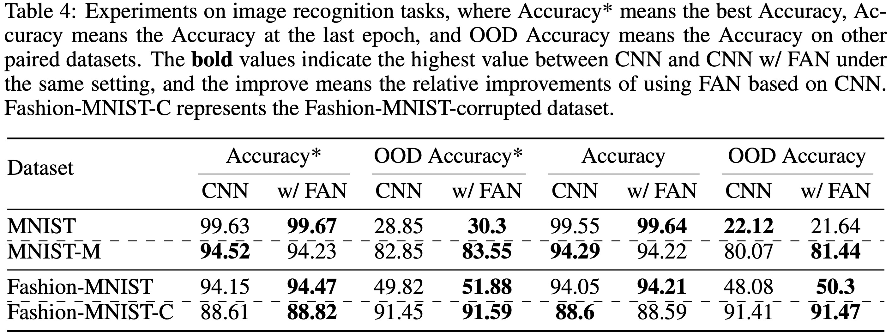

# FAN: Fourier Analysis Networks
[**Paper**](https://arxiv.org/abs/2410.02675)


|                           | MLP Layer                                                |  FAN layer                                                                 |
|---------------------------|:----------------------------------------------------------:|:------------------------------------------------------------------------:|
| **Formula**                | $\Phi(x) = \sigma(B_{m} + W_{m}x)$                       | $\phi(x) = [\cos(W_px)\|\| \sin(W_px)\|\| \sigma(B_{\bar{p}} + W_{\bar{p}}x)]$       |
| **Num of Params**          | $(d_\text{input} \times d_\text{output}) + d_\text{output}$ | $(1-\frac{d_p}{d_\text{output}})\times((d_\text{input} \times d_\text{output}) + d_\text{output})$ |
| **FLOPs**                  | $2\times(d_\text{input} \times d_\text{output})$<br> $+ d_\text{output} \times \text{FLOPs}_\text{non-linear}$ | $(1-\frac{d_p}{d_\text{output}})\times(2\times(d_\text{input} \times d_\text{output}))$ <br> $+ d_\text{output} \times \text{FLOPs}_\text{non-linear} $ |


## Periodicity Modeling
```shell
cd Periodicity_Modeling
bash ./run.sh
```


## Sentiment Analysis
The data can be automatically downloaded using the Huggingface Datasets `load_dataset` function in the `./Sentiment_Analysis/get_dataloader.py`. 

```shell
cd Sentiment_Analysis
bash scripts/Trans_with_FAN/train_ours.sh
bash scripts/Trans_with_FAN/test_ours.sh
```

## Timeseries Forecasting
You can obtain data from [Google Drive](https://drive.google.com/drive/folders/1v1uLx5zhGaNAOTIqHLHYMXtA-XFrKTxS?usp=sharing). All the datasets are well pre-processed and can be used easily.

```shell
cd Timeseries_Forecasting
bash scripts/Weather_script/Modified_Transformer.sh 
```

## Symbolic Formula Representation
```shell
cd Symbolic_Formula_Representation
python gen_dataset.py
bash run_train_fan.sh
```

## Image Recognition
We update the results on image recognition tasks and the detailed setup can be found in the Appendix of our latest-version paper.

```shell
cd Image_Recognition
bash run_image_recognition.sh
```



## Citation
```
@article{dong2024fan,
  title={FAN: Fourier Analysis Networks},
  author={Yihong Dong and Ge Li and Yongding Tao and Xue Jiang and Kechi Zhang and Jia Li and Jing Su and Jun Zhang and Jingjing Xu},
  journal={arXiv preprint arXiv:2410.02675},
  year={2024}
}
```
